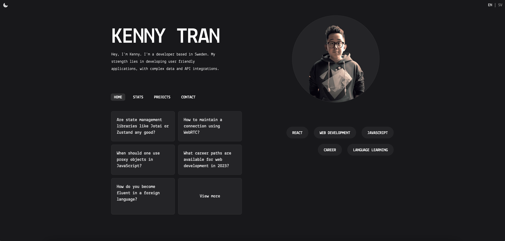

## Run Locally

```bash
pnpm install
pnpm dev
```

## About

This is my digital garden built on Next.js and MDX. Feel free to contribute and use it for inspiration.

## Features

- Markdown support
- Translation support
- SSG with getStaticProps
- Dynamic tag filter
- Scroll indicator
- Syntax highlighting (dracula theme)
- Comment section (utteranc.es)

## Stack

- Next.js
- Typescript
- Tailwind CSS
- MDX
- Framer-motion
- Remark-GFM
- Rehype-highlight

## To-do

- [x] Navigation
- [x] Dashboard
- [x] Projects section
- [x] Contact link

## License

This project is open source and available under the [MIT License](LICENSE.md).
